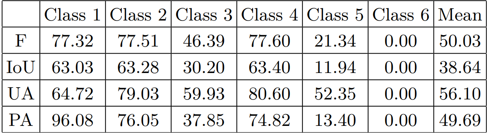
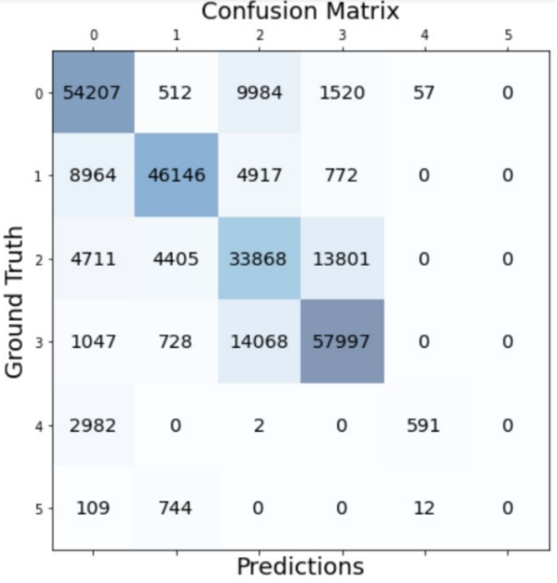

# This repo is containing a comparison of diverse segmentation models on remote sensing images

All models are using the [ISPRS Vaihingen](https://www.isprs.org/education/benchmarks/UrbanSemLab/default.aspx) semantic segmentation dataset. 

There is 5 models compared: 
1. [Hypercolumns](https://arxiv.org/abs/1411.5752)
2. Weighted Hypercolumns
3. [UNet](https://arxiv.org/abs/1505.04597)
4. Weighted UNet
5. Gated Shape Unet, inspired from [GSCNN](https://nv-tlabs.github.io/GSCNN/)

Both _weighted_ models means that the loss elements are weighted based on the number pixel of each class in each image of the training dataset. Hence, more present classes will have a lower weight.

## results

All models were trained for 30 epochs and can be compared on multiple metrics. First the results can be directly viwed and compared to the ground truth. Then, the confusion matrix are shown and used to compute the [Producer and User accuracies](http://gsp.humboldt.edu/olm/Courses/GSP_216/lessons/accuracy/metrics.html). Finally the [F1-Score](https://en.wikipedia.org/wiki/F-score), [Intersection over Union](https://towardsdatascience.com/intersection-over-union-iou-calculation-for-evaluating-an-image-segmentation-model-8b22e2e84686) and [cohen's kappa](https://fr.wikipedia.org/wiki/Kappa_de_Cohen) are referenced.

### Hypercolumns
<table>
  <tr>
    <td>Ground truth</td>
     <td>Non Weighted</td>
     <td>Weighted</td>
  </tr>
  <tr>
    <td> </td>
    <td></td>
    <td></td>
  </tr>
</table>
By simpy looking at those figure, one can see that the performances are not very good, specially for less present classes, i.e. car and clutter. This is also visible when looking at the following confusion matrix and table of results.
<table align="center">
  <tr>
    <td>Non Weighted confusion matrix</td>
    <td>Weighted confusion matrix</td>
  </tr>
  <tr>
    <td> </td>
    <td></td>
  </tr>
</table>
 

<table align="center">
  <tr>
    <td>Non Weighted metrics</td>
    <td>Weighted metrics</td>
  </tr>
  <tr>
    <td> </td>
    <td></td>
  </tr>
</table>

By looking at those images, as imagined from the initial images, the car and clutter classes, i.e. 5 & 6, are performing badly. Finally, the non weighted hypercolumns cohen's kappa is 0.619 and 0.618 for the weighted one.  

 

### UNet
<table>
  <tr>
    <td>Ground truth</td>
     <td>Non Weighted</td>
     <td>Weighted</td>
  </tr>
  <tr>
    <td> </td>
    <td></td>
    <td></td>
  </tr>
</table>

By simpy looking at those figure, one can see that the performances are rather good, eventhough less present classes are not very good. This is also visible when looking at the following confusion matrix and table of results.
<table align="center">
  <tr>
    <td>Non Weighted confusion matrix</td>
    <td>Weighted confusion matrix</td>
  </tr>
  <tr>
    <td> </td>
    <td></td>
  </tr>
</table>
 

<table align="center">
  <tr>
    <td>Non Weighted metrics</td>
    <td>Weighted metrics</td>
  </tr>
  <tr>
    <td> </td>
    <td></td>
  </tr>
</table>

By looking at the confusion matrices, a much stronger diagonal is present indicating the a gain in performance. In addition, when looking at the metrics, around 8 % increase is visible. Finally, the non weighted UNet cohen's kappa is 0.693 and 0.685 for the weighted one which is quite higher than for Hypercolumns.

 

### GSUNet
<table>
  <tr>
    <td>Ground truth</td>
     <td>GSUNet   30 epochs training</td>
     <td>GSUNet   70 epochs training</td>
     <td>UNet   70 epochs training</td>
  </tr>
  <tr>
    <td> </td>
    <td></td>
    <td></td>
    <td></td>
  </tr>
</table>

By simpy looking at those figure, one can see that the performances are rather good, eventhough less present classes are not very good. In additio, as the model is more complex with more parameters, a longer training leads to much more satisfactory results. For comparison purposes, a UNet has been trained for 70 epochs as well. Visually, both GSUNet and UNet are very similar. However, when looking at the confusion matrics, the UNet is leading to better results. This is also visible when looking at the metrics table, a 3-4 % gain for UNet in comparison to GSUNet. This can probably be reduce and/or inverted by having a stronger edge branch for GSUNet.
<table align="center">
  <tr>
    <td>GSUNet 30 epochs   confusion matrix</td>
    <td>GSUNet 70 epochs   confusion matrix</td>
    <td>UNet 70 epochs   confusion matrix</td>
  </tr>
  <tr>
    <td> </td>
    <td></td>
    <td></td>
  </tr>
</table>
 

<table align="center">
  <tr>
    <td>GSUNet 30 epochs   metrics</td>
    <td>GSUNet 70 epochs   metrics</td>
    <td>UNet 70 epochs   metrics</td>
  </tr>
  <tr>
    <td> </td>
    <td></td>
    <td></td>
  </tr>
</table>

